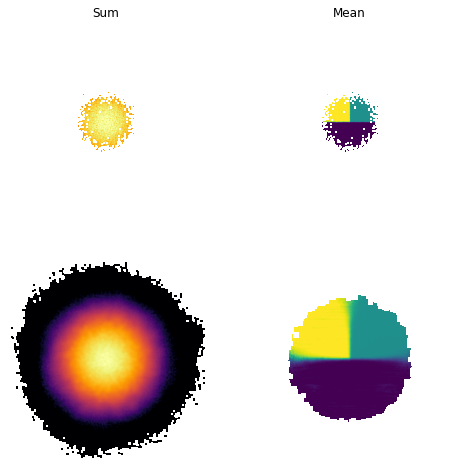

# **README** for `smooth3d`

## Contact: <garrethmartin@arizona.edu>

-----

## Purpose:

Adaptively smooths sparsely sampled particles according to their local density. 
Similar to the approach described in [Merritt+2020, Section 3.1](https://ui.adsabs.harvard.edu/abs/2020MNRAS.495.4570M/abstract "Merritt+2020")

The basic method is as follows:

1. Calculate the *k*-NN local number density in units of image element (i.e. pixel length$^{3}$) for every particle
2. For every particle below the density threshold (3 particles per element by default), calculate the *k*-NN distance, *d*
3. Split each of these particles into *N* sub-particles with a 3D Gaussian distribution with the mean equal to the original particle and *sigma=d*
4. Bin the new particles

**Currently options for smoothing the sum and mean values**

## Prerequisites:

  - numpy
  - scipy
  - sklearn
  - [fast_histogram](https://pypi.org/project/fast-histogram/)
  - tqdm

## Usage

*inputs*:

   **X**:            particle co-ordinates: array shape=(3, Nparticles)
   
   **quantity_sum**: particle quantities to be summed: array shape=(Nquantities, Nparticles); ignore if `[False]`
   
   **quantity_average**: particle quantities to be averaged: array shape=(Nquantities, Nparticles); ignore if `[False]`
   
   **res**:          desired size of resolution unit in same units as X
   
   **extent**:       desired size of the image in the same units as X
   
   **upper_threshold**: number density of particles above which they will no longer be smoothed
   
   **lower_threshold**: number density of particles below which they will no longer be smoothed
   
   **njobs**:        number of workers to assign
   
   **nsteps**:       total number of density bins to do smoothing over, keep this fairly large or the result will lose accuracy
   
   **k**:            k nearest neighbour density estimate
   
   **n_resample**:   number of sub-particles to split each particle into for smoothing
   
   **projection**:   axis of projection used to produce the images
   
   **antialias**:    specifies whether the final image is antialiased
   
 *outputs*:
 
   **img**:         smoothed image for each summed quantity: shape = (Nquantities, Npixels, Npixels)
   
   **average_img**: smoothed image for each averaged quantity: shape = (Nquantities, Npixels, Npixels)

### Example script

  `python example.py`

